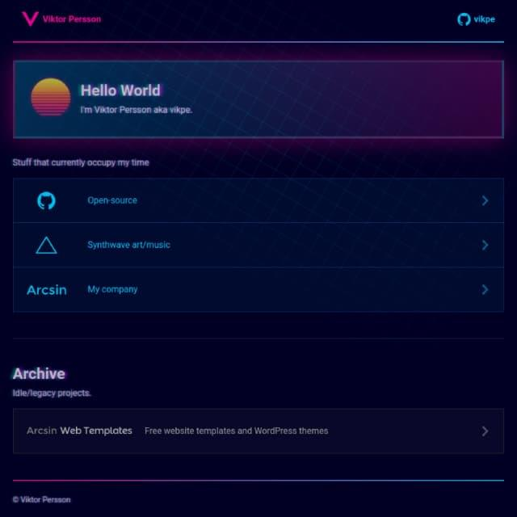

# vikpe.org
> 🦄🚀🌌

My synthwave inspired personal website, built with [Astro](https://astro.build/) and [tailwindcss](https://tailwindcss.com/).

---

## Development
1. Clone/download repo
2. `yarn install`
4. `yarn dev` - site is served @ **`http://localhost:3000`** with live updates.

---

## All commands
| Command        | Action                                       |
|----------------|----------------------------------------------|
| `yarn dev`     | Starts local dev server at `localhost:3000`  |
| `yarn build`   | Build your production site to `./dist/`      |
| `yarn preview` | Preview your build locally, before deploying |
| `yarn format`  | Format code using prettier                   |
